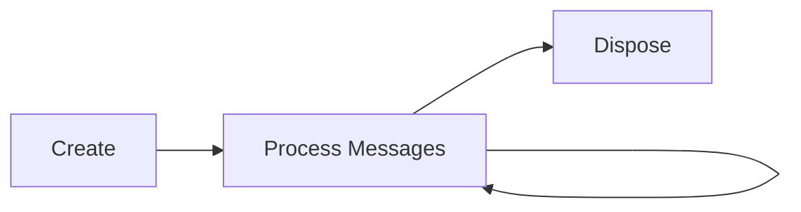

# ServiceJS Core Concepts

A comprehensive guide to the fundamental concepts powering the ServiceJS framework.

## Table of Contents

- [Philosophy](#philosophy)
- [Messages and Message Passing](#messages-and-message-passing)
- [Capabilities and Security](#capabilities-and-security)
- [Reducers and Pure Functions](#reducers-and-pure-functions)
- [Effects and Side Effects](#effects-and-side-effects)
- [Session Types and Protocol Evolution](#session-types-and-protocol-evolution)
- [Components and Lifecycle](#components-and-lifecycle)
- [Putting It All Together](#putting-it-all-together)

---

## Philosophy

ServiceJS is built on three core principles:

### 1. **Pure Message Passing**

Objects communicate ONLY via messages, never through direct method calls. This enables:
- Location transparency (local, remote, workers)
- Testability (easy to mock and inspect)
- Time-travel debugging (replay message sequences)
- Concurrency (natural asynchronous communication)

### 2. **Capability-Based Security**

Components interact ONLY via explicit capability references. This provides:
- Principle of least privilege (minimal access by default)
- Fine-grained security (controlled message types)
- Revocable access (capabilities can be invalidated)
- Audit trails (all communication is traceable)

### 3. **Tiny Core, Everything Else Utilities**

The framework core is minimal and unopinionated. All features are opt-in:
- No magic framework behavior
- Explicit over implicit
- Compose only what you need
- Zero-cost abstractions

---

## Messages and Message Passing

### What are Messages?

Messages are immutable data structures that components send to each other. They're the **only** way components communicate.

```typescript
import { createMessage, type MessageOf } from '@servicejs/core';

// Define message types
const IncrementMsg = createMessage<'increment', { amount: number }>('increment');
const GetCountMsg = createMessage<'getCount', {}>('getCount');

type CounterMessage =
  | MessageOf<typeof IncrementMsg>
  | MessageOf<typeof GetCountMsg>;

// Create messages
const msg1 = IncrementMsg({ amount: 5 });
const msg2 = GetCountMsg({});
```

### Why Message Passing?

**Traditional OOP (Direct Calls):**
```typescript
// ❌ Tight coupling, not location-transparent
class Counter {
  private count = 0;

  increment(amount: number) {
    this.count += amount;
  }

  getCount(): number {
    return this.count;
  }
}

const counter = new Counter();
counter.increment(5); // Direct call - can't be remote
```

**ServiceJS (Message Passing):**
```typescript
// ✅ Loose coupling, location-transparent
const counterCap = createCounterComponent();

// Send message (works locally or remotely)
counterCap.send(IncrementMsg({ amount: 5 }));
```

### Message Properties

1. **Immutable** - Messages never change after creation
2. **Serializable** - Can be sent across process boundaries
3. **Typed** - Full TypeScript type safety
4. **Traceable** - Can be logged, replayed, inspected

---

## Capabilities and Security

### What are Capabilities?

A **capability** is a reference that grants the right to send messages to a component. It's the **only** way to interact with a component.

```typescript
import { type Capability } from '@servicejs/core';

// A capability for sending CounterMessages
type CounterCapability = Capability<CounterMessage>;

// Create a component
const { component, capability } = createComponent(
  'urn:counter:main',
  { count: 0 },
  counterReducer
);

// Capability is the ONLY reference to the component
capability.send(IncrementMsg({ amount: 5 }));
```

### Capability-Based Security Model

**Traditional Access Control:**
```typescript
// ❌ Ambient authority - anyone with reference can do anything
class BankAccount {
  withdraw(amount: number) {
    // Who called this? Are they authorized?
    // Must check permissions every time
  }
}
```

**Capability-Based:**
```typescript
// ✅ Possession of capability IS authorization
type WithdrawCapability = Capability<WithdrawMessage>;

// If you have the capability, you can withdraw
// If you don't have it, you can't
function withdraw(cap: WithdrawCapability, amount: number) {
  cap.send(WithdrawMsg({ amount }));
}
```

### Capability Transformations

Capabilities can be transformed to restrict or adapt access:

```typescript
import { mapCapability, filterCapability } from '@servicejs/core';

// Original capability (unrestricted)
const fullCapability: Capability<CounterMessage> = /* ... */;

// Read-only capability (filter out increment messages)
const readOnlyCap = filterCapability(
  fullCapability,
  (msg) => msg.type !== 'increment'
);

// Logged capability (intercept all messages)
const loggedCap = mapCapability(fullCapability, (msg) => {
  console.log('Message sent:', msg);
  return msg;
});
```

### Capability Composition

```typescript
import { composeCapabilities } from '@servicejs/core';

// Chain transformations
const restrictedCap = composeCapabilities(
  fullCapability,
  (cap) => filterCapability(cap, (msg) => msg.type !== 'increment'),
  (cap) => mapCapability(cap, (msg) => {
    console.log('Allowed message:', msg);
    return msg;
  })
);
```

---

## Reducers and Pure Functions

### What are Reducers?

A **reducer** is a pure function that defines how a component responds to messages. It takes the current state and a message, and returns the new state plus effects.

```typescript
import { stay, type Reducer } from '@servicejs/core';

type CounterState = { count: number };

const counterReducer: Reducer<CounterState, CounterMessage> = (state, message) => {
  switch (message.type) {
    case 'increment':
      return stay(
        { count: state.count + message.amount },
        counterReducer,
        [] // No effects
      );

    case 'getCount':
      // Send reply
      return stay(
        state, // State unchanged
        counterReducer,
        [emitTo(message.replyTo, Ok(state.count))]
      );
  }
};
```

### Pure Function Properties

Reducers MUST be **pure functions**:

1. **Deterministic** - Same inputs always produce same outputs
2. **No side effects** - Don't modify external state
3. **No I/O** - Don't read/write files, make network calls, etc.

**Bad (Impure):**
```typescript
// ❌ Side effects, non-deterministic
const badReducer = (state: State, message: Message) => {
  console.log('Got message'); // Side effect!
  state.count++; // Mutation!
  fetch('/api/data'); // I/O!
  const random = Math.random(); // Non-deterministic!

  return stay(state, badReducer, []);
};
```

**Good (Pure):**
```typescript
// ✅ Pure function, effects as data
const goodReducer = (state: State, message: Message) => {
  const newState = { count: state.count + 1 }; // New object

  const effects = [
    emitTo(loggingCap, { type: 'log', message: 'Got message' }),
    emitTo(apiCap, { type: 'fetch', url: '/api/data' }),
  ];

  return stay(newState, goodReducer, effects);
};
```

### Why Pure Reducers?

Pure reducers enable:
- **Testing** - Easy to test without mocks
- **Time Travel** - Replay message sequences
- **Predictability** - Always know what will happen
- **Concurrency** - Safe to parallelize
- **Debugging** - Inspect state at any point

---

## Effects and Side Effects

### Effects as Data Structures

In ServiceJS, side effects are represented as **data structures** (effects) that describe what should happen. They're returned from reducers and executed by the framework.

```typescript
import { emitTo, batch, none, type Effect } from '@servicejs/core';

// Effect: Send a message to another component
const effect1: Effect = emitTo(loggerCap, { type: 'log', message: 'Hello' });

// Effect: Multiple messages
const effect2: Effect = batch([
  emitTo(databaseCap, { type: 'save', data: user }),
  emitTo(analyticsCap, { type: 'track', event: 'user-created' }),
]);

// Effect: No side effects
const effect3: Effect = none();
```

### Effect Execution

The component runtime executes effects:

```typescript
const counterReducer = (state: State, message: Message) => {
  switch (message.type) {
    case 'increment':
      const newState = { count: state.count + 1 };

      // Return effects to be executed
      return stay(newState, counterReducer, [
        emitTo(loggerCap, { type: 'log', message: `Count: ${newState.count}` }),
        emitTo(analyticsCap, { type: 'track', event: 'increment' }),
      ]);
  }
};
```

### Why Effects as Data?

**Benefits:**
1. **Testability** - Effects can be inspected without executing
2. **Predictability** - Clear what will happen
3. **Composability** - Effects can be combined
4. **Time Travel** - Effects can be replayed or skipped

**Example Test:**
```typescript
test('increment produces correct effects', () => {
  const state = { count: 0 };
  const message = IncrementMsg({ amount: 5 });

  const result = counterReducer(state, message);

  expect(result.state.count).toBe(5);
  expect(result.effects).toHaveLength(2);
  expect(result.effects[0].type).toBe('emit');
});
```

---

## Session Types and Protocol Evolution

### What are Session Types?

**Session types** allow a component's protocol (accepted messages) to change over time. This enables type-safe state machines and protocol enforcement.

### Reducer Replacement

Use `become()` instead of `stay()` to change the reducer:

```typescript
import { stay, become, type Reducer } from '@servicejs/core';

// State machine: Locked -> Unlocked -> Locked
type DoorState = { locked: boolean };
type DoorMessage = UnlockMsg | LockMsg | OpenMsg;

const lockedReducer: Reducer<DoorState, DoorMessage> = (state, message) => {
  switch (message.type) {
    case 'unlock':
      // Transition to unlocked state
      return become(
        { locked: false },
        unlockedReducer, // Different reducer!
        []
      );

    case 'open':
      // Can't open when locked
      return stay(state, lockedReducer, [
        emitTo(message.replyTo, Err(new Error('Door is locked'))),
      ]);

    default:
      return stay(state, lockedReducer, []);
  }
};

const unlockedReducer: Reducer<DoorState, DoorMessage> = (state, message) => {
  switch (message.type) {
    case 'lock':
      // Transition back to locked state
      return become(
        { locked: true },
        lockedReducer,
        []
      );

    case 'open':
      // Can open when unlocked
      return stay(state, unlockedReducer, [
        emitTo(message.replyTo, Ok(undefined)),
      ]);

    default:
      return stay(state, unlockedReducer, []);
  }
};
```

### Protocol Evolution Example

```typescript
// Connection protocol: Disconnected -> Connecting -> Connected -> Disconnected

type DisconnectedReducer = Reducer<State, DisconnectMessage>;
type ConnectingReducer = Reducer<State, ConnectingMessage>;
type ConnectedReducer = Reducer<State, ConnectedMessage>;

const disconnectedReducer: DisconnectedReducer = (state, message) => {
  if (message.type === 'connect') {
    return become(
      { ...state, status: 'connecting' },
      connectingReducer, // Transition to connecting
      [emitTo(networkCap, { type: 'initiate-connection' })]
    );
  }
  return stay(state, disconnectedReducer, []);
};

const connectingReducer: ConnectingReducer = (state, message) => {
  if (message.type === 'connection-established') {
    return become(
      { ...state, status: 'connected' },
      connectedReducer, // Transition to connected
      []
    );
  }
  return stay(state, connectingReducer, []);
};

const connectedReducer: ConnectedReducer = (state, message) => {
  if (message.type === 'disconnect') {
    return become(
      { ...state, status: 'disconnected' },
      disconnectedReducer, // Transition to disconnected
      [emitTo(networkCap, { type: 'close-connection' })]
    );
  }
  return stay(state, connectedReducer, []);
};
```

### Benefits of Session Types

1. **Type Safety** - Compiler enforces valid message sequences
2. **Protocol Clarity** - State machine is explicit
3. **Runtime Validation** - Invalid messages rejected
4. **Documentation** - Protocol is self-documenting

---

## Components and Lifecycle

### What are Components?

A **component** is a stateful entity that processes messages via a reducer. Components encapsulate state and behavior.

```typescript
import { createComponent } from '@servicejs/core';

// Create a component
const { component, capability } = createComponent(
  'urn:counter:main', // Unique identifier
  { count: 0 }, // Initial state
  counterReducer // Message handler
);

// Interact via capability only
capability.send(IncrementMsg({ amount: 5 }));

// Access current state
const state = component.getState(); // { count: 5 }
```

### Component Lifecycle

Components follow a simple lifecycle:



**With Optional Lifecycle Hooks:**

```typescript
import { withLifecycle } from '@servicejs/lifecycle';

const { component, capability } = createComponent(
  'urn:database:conn',
  { connected: false },
  reducer
);

// Add lifecycle hooks
const managed = withLifecycle(component, {
  async onInit() {
    console.log('Initializing database connection...');
    await database.connect();
  },

  async onShutdown() {
    console.log('Closing database connection...');
    await database.disconnect();
  },
});

// Manually trigger lifecycle
await managed.init(); // Calls onInit
await managed.shutdown(); // Calls onShutdown
```

### Component Isolation

Components are isolated from each other:

```typescript
// Component A cannot directly access Component B's state
const compA = createComponent('urn:a', stateA, reducerA);
const compB = createComponent('urn:b', stateB, reducerB);

// ❌ Cannot do this
compA.component.getState(); // Only owner can access

// ✅ Must use capabilities
compA.capability.send(messageForA);
compB.capability.send(messageForB);
```

---

## Putting It All Together

### Complete Example: Task Manager

```typescript
import {
  createComponent,
  createMessage,
  stay,
  emitTo,
  type Reducer,
  type Capability,
  type MessageOf,
} from '@servicejs/core';
import { Ok, Err } from '@servicejs/result';

// === Messages ===

const AddTaskMsg = createMessage<'addTask', { title: string; replyTo: Capability<any> }>('addTask');
const CompleteTaskMsg = createMessage<'completeTask', { id: number; replyTo: Capability<any> }>('completeTask');
const GetTasksMsg = createMessage<'getTasks', { replyTo: Capability<any> }>('getTasks');

type TaskMessage =
  | MessageOf<typeof AddTaskMsg>
  | MessageOf<typeof CompleteTaskMsg>
  | MessageOf<typeof GetTasksMsg>;

// === State ===

type Task = { id: number; title: string; completed: boolean };
type TaskManagerState = {
  tasks: Task[];
  nextId: number;
};

// === Reducer ===

const taskReducer: Reducer<TaskManagerState, TaskMessage> = (state, message) => {
  switch (message.type) {
    case 'addTask': {
      const task: Task = {
        id: state.nextId,
        title: message.title,
        completed: false,
      };

      return stay(
        {
          tasks: [...state.tasks, task],
          nextId: state.nextId + 1,
        },
        taskReducer,
        [emitTo(message.replyTo, Ok(task))]
      );
    }

    case 'completeTask': {
      const taskIndex = state.tasks.findIndex((t) => t.id === message.id);

      if (taskIndex === -1) {
        return stay(state, taskReducer, [
          emitTo(message.replyTo, Err(new Error('Task not found'))),
        ]);
      }

      const updatedTasks = [...state.tasks];
      updatedTasks[taskIndex] = { ...updatedTasks[taskIndex], completed: true };

      return stay(
        { ...state, tasks: updatedTasks },
        taskReducer,
        [emitTo(message.replyTo, Ok(updatedTasks[taskIndex]))]
      );
    }

    case 'getTasks': {
      return stay(state, taskReducer, [emitTo(message.replyTo, Ok(state.tasks))]);
    }
  }
};

// === Create Component ===

const { component, capability: taskManagerCap } = createComponent(
  'urn:taskmanager:main',
  { tasks: [], nextId: 1 },
  taskReducer
);

// === Usage ===

// Create a reply capability to receive responses
const { capability: replyCap } = createComponent(
  'urn:reply:client',
  {},
  (state, message) => {
    console.log('Received response:', message);
    return stay(state, arguments.callee, []);
  }
);

// Add tasks
taskManagerCap.send(AddTaskMsg({ title: 'Learn ServiceJS', replyTo: replyCap }));
taskManagerCap.send(AddTaskMsg({ title: 'Build an app', replyTo: replyCap }));

// Complete a task
taskManagerCap.send(CompleteTaskMsg({ id: 1, replyTo: replyCap }));

// Get all tasks
taskManagerCap.send(GetTasksMsg({ replyTo: replyCap }));

// Check final state
console.log('Tasks:', component.getState().tasks);
```

---

## Key Takeaways

1. **Messages** - Components communicate only via immutable messages
2. **Capabilities** - The only way to send messages to a component
3. **Reducers** - Pure functions that process messages and return state + effects
4. **Effects** - Side effects as data structures, executed by framework
5. **Session Types** - Reducers can change (become) for protocol evolution
6. **Components** - Stateful entities with encapsulated state
7. **Isolation** - Components can't directly access each other

---

## Next Steps

- **[Migration Guide](./MIGRATION_GUIDE.md)** - Migrate from traditional TypeScript patterns
- **[Examples](../packages/core/examples/)** - See complete working examples
- **[API Reference](../packages/core/README.md)** - Detailed API documentation
- **[Design Document](../DESIGN_DOC.md)** - Complete architectural vision

---

## Resources

- [ServiceJS GitHub](https://github.com/servicejs/servicejs)
- [Core Package](../packages/core/)
- [Design Philosophy](../DESIGN_DOC.md)
